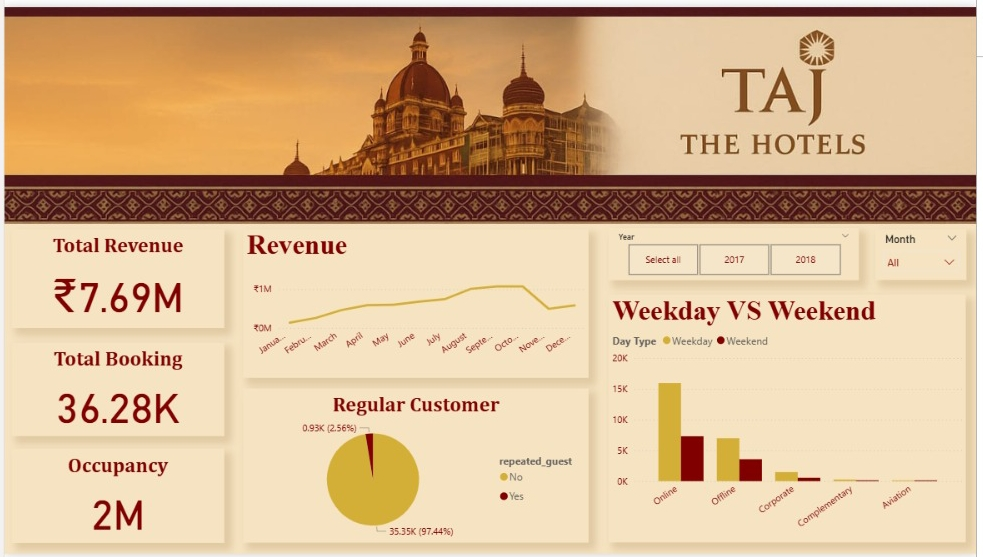
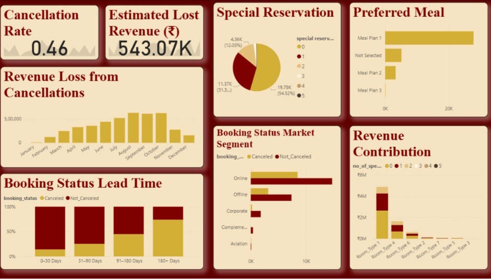

# Hotel Analytics Dashboard

## Project Overview
This Power BI dashboard analyzes hotel booking trends, revenue performance, customer behavior, and occupancy metrics.

## Tools Used
- Power BI
- Excel
- DAX

## Key Insights
- Revenue trends by month
- Booking cancellation analysis
- Customer segmentation
- Occupancy performance

## Dashboard Preview

## Files
- HotelDashboard.pbix
- Dashboard Screenshots# Taj-Hotel-PowerBI-

Dashboard
Power BI dashboard analyzing hotel booking data and business insights.
